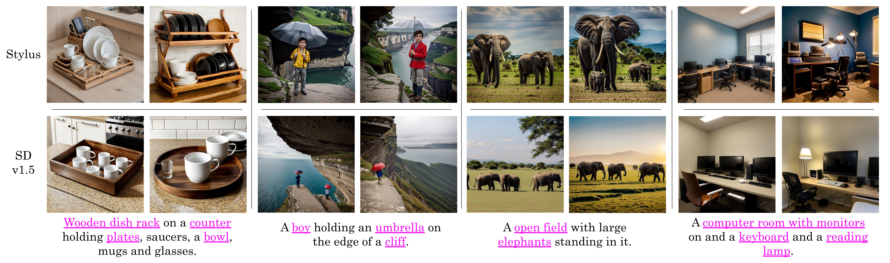

# 🖌️ Stylus: Automatic Adapter Selection for Diffusion Models

<p align="center">
  <a href="https://michaelzhiluo.github.io/stylus/"></a>
  <a href=""></a>
  <a href="https://drive.google.com/file/d/1iMYQWHraC1JT78-MYOapvGNIuLoTMO-x/view?usp=sharing" ></a>
</p>

## 🌎 Overview

Stylus automatically retrieves and composes relevant adapters based on prompts' keywords.


## 🔮 Abstract

Beyond scaling base models with more data or parameters, fine-tuned adapters provide an alternative way to generate high fidelity, custom images at reduced costs. As such, adapters have been widely adopted by open-source communities, accumulating a database of over 100K adapters—most of which are highly customized with insufficient descriptions. To generate high quality images, this paper explores the problem of matching the prompt to a Stylus of relevant adapters, built on recent work that highlight the performance gains of composing adapters. We introduce Stylus, which efficiently selects and automatically composes task-specific adapters based on a prompt's keywords. Stylus outlines a three-stage approach that first summarizes adapters with improved descriptions and embeddings, retrieves relevant adapters, and then further assembles adapters based on prompts' keywords by checking how well they fit the prompt. To evaluate Stylus, we developed StylusDocs, a curated dataset featuring 75K adapters with pre-computed adapter embeddings. In our evaluation on popular Stable Diffusion checkpoints, Stylus achieves greater CLIP/FID Pareto efficiency and is twice as preferred, with humans and multimodal models as evaluators, over the base model.

</img>

## Roadmap

- [ ] Release Stylus inference pipeline.
- [ ] Release Stylus evaluation scripts.
- [ ] Release framework for generating StylusDocs.

## 🎯 Citation

```
@inproceedings{VisDiff,
  title={Describing Differences in Image Sets with Natural Language},
  author={Dunlap, Lisa and Zhang, Yuhui and Wang, Xiaohan and Zhong, Ruiqi and Darrell, Trevor and Steinhardt, Jacob and Gonzalez, Joseph E. and Yeung-Levy, Serena},
  booktitle={Conference on Computer Vision and Pattern Recognition (CVPR)},
  year={2024}
}
```

